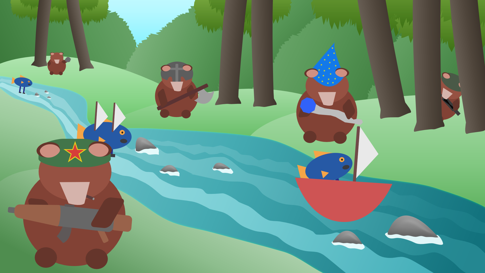

# OOPP_TD
Object Oriented Programming Project - Tower Defense
---
```
   _____                             _                          ____                               _______ _____  
  / ____|                           | |                        / __ \                             |__   __|  __ \ 
 | (___  _   _ _ __   ___ _ __    __| |_   _ _ __   ___ _ __  | |  | |_ __ ___   ___  __ _  __ _     | |  | |  | |
  \___ \| | | | '_ \ / _ \ '__|  / _` | | | | '_ \ / _ \ '__| | |  | | '_ ` _ \ / _ \/ _` |/ _` |    | |  | |  | |
  ____) | |_| | |_) |  __/ |    | (_| | |_| | |_) |  __/ |    | |__| | | | | | |  __/ (_| | (_| |    | |  | |__| |
 |_____/ \__,_| .__/ \___|_|     \__,_|\__,_| .__/ \___|_|     \____/|_| |_| |_|\___|\__, |\__,_|    |_|  |_____/ 
              | |                           | |                                       __/ |                       
              |_|                           |_|                                      |___/                       
```



---
## Members in Super duper Omega gruppen:

* Behroz = BehrozRazaq
* Erik = OneZeroWasTaken
* Oskar = OggTechnologies
* Samuel = ApansKaffekopp
* Sebastian = Sebulon, s33b00r

---
## Running the Game
Just dubble click on the .exe file in the root folder to start the game.

## Description
Super duper Omega TD is a tower defense game highly inspired by Bloons Tower Defense. Play as bears trying to defend their honey from highly evolved fish.
